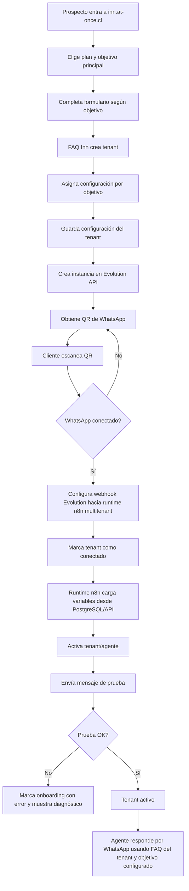

# FAQ Inn

## Bitácora de cambios

| Fecha | Versión | Cambio realizado | Motivo | Impacto | Sección afectada |
|---|---|---|---|---|---|
| 2026-07-10 | V1.20 | Catálogo default de categorías FAQ reducido a 2: «Sin categoría» y «Pregunta sin respuesta». | Simplificar el seed administrativo; el resto se crea a demanda. | Migración retira defaults viejos (`Respuesta interna`, `Responsable 1/2`) y reasigna FAQs a «Sin categoría». | 14.5.2 |
| 2026-07-10 | V1.19 | Se documenta categoría administrativa vs keywords y se excluye la categoría de la vectorización FAQ (`buildVectorizableText`). Export Excel pasa a `category_id`. | La categoría es metadato interno del tenant; no debe influir en la búsqueda semántica. Las keywords sí. | Tras deploy API, reindexar FAQs para que Qdrant deje de indexar `Categoria:`. | 14.5.1, 14.5.2 |
| 2026-07-08 | V1.18 | Se agrega `tenant_settings.custom_sprompt` (admin-only) concatenado al final del system prompt. UI: Admin → Ver tenant → Custom SPrompt. Documentada matriz 6×4 de bloques por objetivo. | Permitir system prompts hiper-personalizados por tenant sin alterar las plantillas globales por objetivo; si está vacío no altera el prompt. | Runtime entrega `custom_sprompt`; `Armar SPrompt` lo resuelve; el agente lo appende; admin edita solo desde View. | System Prompt Configurable, Admin, n8n FAQ Productivo, Variables |
| 2026-07-08 | V1.17 | Se consolida el workflow multitenant `FAQ Productivo` (webhook Evolution) y se documenta la customización del agente por objetivo vía System Prompt Configurable (tokens neutros + composición en n8n). Se agrega tool de agenda (`/api/runtime/agenda-link`) y se define pauta anti-loop bot-a-bot (rol/límites). | Era necesario pasar de flujo de prueba a producción sin hardcodeos, permitir prompts editables por objetivo y evitar loops entre agentes al probar con dos WhatsApp. | n8n opera con `FAQ Productivo` como flujo productivo; el system prompt se arma en el nodo Code `Armar SPrompt` a partir de `sprompt.*` (DB) + runtime; URLs se consumen desde `tenant_url`; agenda-link usa `date` + `time` y retorna `short_url`. | n8n como motor de conversaciones, Variables obligatorias, System Prompt Configurable, Motor agenda/runtime |
| 2026-07-07 | V1.16 | Se crea y registra el módulo documental `calcom` como proveedor opcional de agenda para tenants sin calendario propio. | FAQ Inn necesita soportar el objetivo `reservar_horarios` cuando el tenant no usa Google Calendar, Microsoft Calendar ni otro sistema externo. | Cal.com queda definido como servicio opcional levantado en EasyPanel; el Programador debe tratarlo como proveedor parametrizado por tenant y no hardcodear links ni asumirlo para todos los tenants. | docs/calcom, Modelo por objetivos, Variables obligatorias, n8n, Estado actual |
| 2026-07-07 | V1.15 | Se define `system_prompt_objective_templates` como tabla editable desde Admin web para construir el system prompt por objetivo. | El prompt prototipo de `reservar_noches` se separó fielmente en columnas semánticas: rol, límites, tools, interpretación de fechas, recolección y links. | El Programador debe crear CRUD Admin para objetivos, permitir nuevos objetivos futuros, resolver variables antes del AI Agent y registrar snapshot/hash/version del prompt final. | docs/systemprompt-configurable, Modelo por objetivos, Variables obligatorias, Estado actual |
| 2026-07-07 | V1.14 | Se renombra el subproyecto `prompts` a `systemprompt-configurable` y se define el módulo System Prompt Configurable. | El diseño requiere que el system prompt se componga desde secciones administrables por objetivo, tenant y cliente, sin hardcodear el prompt completo en n8n. | El Programador debe implementar tablas/secciones versionadas, composición runtime antes del AI Agent, fallback global y auditoría del prompt usado por conversación. | docs/systemprompt-configurable, Modelo por objetivos, Variables obligatorias, Estado actual |
| 2026-07-06 | V1.13 | Se redefine FAQ Inn como modelo por objetivos. | El diseño del agente confirmó que el eje operativo debe ser el objetivo elegido por el tenant durante onboarding. | `objetivo_slug` pasa a gobernar prompt, herramientas, variables conversacionales y link-builder; `business_type` queda como contexto del negocio. `system_prompt_multitenant.md` queda como auxiliar temporal, no como fuente oficial. | Objetivo del proyecto, Alcance inicial, Modelo por objetivos, Variables obligatorias, Estado actual |
| 2026-07-05 | V1.12 | Se consolida inventario único de variables del proyecto por módulo. | El módulo `motor-reservas` incorporó variables nuevas y el runtime n8n ya consume variables adicionales de tenant, agente, pausa, Evolution API, FAQ y reservas. | El README principal pasa a gobernar las variables canónicas de FAQ Inn y separa responsabilidad por módulo para evitar hardcodeos y duplicación documental. | Variables obligatorias por tenant, motor-reservas, n8n como motor de conversaciones |
| 2026-07-05 | V1.11 | Se crea módulo documental `motor-reservas`. | Separar la lógica de descubrimiento y validación de URLs de reserva del prompt y del runtime conversacional n8n. | FAQ Inn tendrá una página/servicio para construir `tenant_url` (URL fija o plantilla) por tenant usando links de prueba; n8n consumirá solo URLs/plantillas aprobadas. | docs/motor-reservas, n8n como motor de conversaciones, Estado actual |
| 2026-07-04 | V1.10 | Cierre documental del módulo Evolution API (onboarding MVP). | Validación operativa en inn.at-once.cl y alineación con arquitectura V1.9. | Subproyecto `01-evolution-onboarding-mvp` aprobado; pendientes explícitos (token instancia, desconexión teléfono, payload n8n) fuera de alcance. | docs/evolution-api, docs/pruebas, Estado actual |
| 2026-07-04 | V1.9 | Se define la resolución runtime del tenant desde webhook Evolution API. | El onboarding debe guardar todos los datos del cliente y n8n debe operar sin datos hardcodeados. | El runtime n8n identificará la instancia Evolution recibida en el webhook, consultará PostgreSQL/API y cargará configuración completa del tenant/agente antes de conversar. | Arquitectura objetivo, Evolution API, n8n, Datos por tenant, Estado actual |
| 2026-07-04 | V1.8 | Se acota el MVP inmediato a onboarding automático de WhatsApp con Evolution API. | El auditor recomienda validar primero la creación de tenant, instancia Evolution, QR y conexión antes de invertir en n8n conversacional o FAQs. | El primer MVP queda limitado a registro mínimo, creación de instancia `faqinn_<tenant_slug>`, QR, polling de estado y marcado `connected`; n8n, FAQs, prompts y conversación quedan fuera de alcance de este MVP. | Alcance inicial, Arquitectura objetivo, Onboarding, Evolution API, Estado actual |
| 2026-07-04 | V1.7 | Se normaliza la arquitectura MVP: onboarding gobernado por backend FAQ Inn, Evolution API creada por provisioner y n8n como workflow compartido multitenant. | El proyecto avanzó desde diseño conceptual hacia pruebas reales con Evolution API y `FAQ prototipo`; era necesario eliminar ambigüedad entre workflow por tenant y workflow compartido. | Queda definido que el MVP no generará un workflow n8n por tenant; usará un runtime n8n compartido que carga configuración por tenant. Se crean subproyectos de prueba documentados. | Arquitectura objetivo, Provisioner, Evolution API, n8n, Estado actual |
| 2026-07-02 | V1.6 | Se valida operativamente el PostgreSQL de FAQ Inn. | Miguel ejecuta consulta interna desde el contenedor y confirma respuesta correcta de PostgreSQL. | Queda confirmado PostgreSQL 17.10, base `faq-inn`, usuario `postgres`, puerto interno 5432 y sin puerto público externo. | Configuración EasyPanel PostgreSQL, Estado actual |
| 2026-07-02 | V1.5 | Se confirma creación real del PostgreSQL de FAQ Inn en EasyPanel. | Miguel crea el servicio y aporta captura con credenciales visibles del servicio. | Host interno real confirmado: `n8n_faq-inn_postgres`; base `faq-inn`; usuario `postgres`; imagen `postgres:17`; puerto interno 5432; sin puerto público externo. La contraseña no se documenta. | Configuración EasyPanel PostgreSQL, Estado actual |
| 2026-07-02 | V1.4 | Se define la configuración base para crear PostgreSQL en EasyPanel. | Miguel inicia la creación del servicio Postgres propio de FAQ Inn en EasyPanel. | El servicio debe llamarse `faq-inn_postgres`, usar base `faq-inn`, usuario `postgres`, imagen `postgres:17`, contraseña autogenerada por EasyPanel y sin puerto público externo. | Base de datos, Configuración EasyPanel PostgreSQL |
| 2026-07-02 | V1.3 | Se define PostgreSQL propio e interno para FAQ Inn. | FAQ Inn requiere aislamiento de datos y no debe usar la base compartida existente del ecosistema n8n. | El servicio `faq-inn_postgres` debe operar solo por red interna, en puerto 5432, sin puerto público externo. | Base de datos, Variables por tenant, Próxima etapa técnica, Estado actual |
| 2026-07-02 | V1.2 | Se definen las variables iniciales por tenant y el primer cambio obligatorio para el Programador. | La base heredada desde DFAQ debe reconstruirse como producto multitenant de FAQ Inn, evitando valores fijos del sistema anterior. | El desarrollo debe iniciar en versión de código 1.0 usando tenant de desarrollo `FAQ-INN`, título HTTP `FAQ Inn $Tenant` y base PostgreSQL derivada de `$tenant`. | Variables por tenant, Próxima etapa técnica, Estado actual |
| 2026-07-02 | V1.1 | Se define `faq-inn` como repositorio GitHub oficial del proyecto. | El proyecto necesitaba una definición documental explícita para evitar ambigüedad entre reutilizar `dfaq`, crear branch/fork o mantener repositorio propio. | El Programador debe usar `faq-inn` como repositorio independiente de FAQ Inn; DFAQ/MorroReservas queda sin cambios operativos. | Repositorio GitHub oficial, Etapa técnica inicial, Estado actual |
| 2026-07-02 | V1.0 | Creación del proyecto FAQ Inn como evolución separada de DFAQ. | MorroReservas está en producción y debe quedar congelado; el nuevo producto requiere onboarding, Evolution API, QR WhatsApp y generación automática de workflows n8n sin afectar `dfaq.at-once.cl`. | Se crea proyecto documental separado bajo `FAQ Inn`; `dfaq.at-once.cl` queda como producción/legacy de MorroReservas y `inn.at-once.cl` queda como dominio objetivo del nuevo producto. | Todo el documento |

---

## 1. Objetivo del proyecto

Construir **FAQ Inn**, una plataforma SaaS inicialmente orientada por objetivo operativo, basada en el aprendizaje técnico de DFAQ/MorroReservas pero separada de la producción existente.

El objetivo es que un nuevo cliente pueda registrarse, cargar datos de su negocio, vincular su WhatsApp mediante QR, cargar sus preguntas y respuestas, y quedar con un agente operativo sin que Miguel tenga que editar manualmente n8n, Qdrant, Evolution API o archivos técnicos.

El producto se organiza por objetivo operativo. Cada tenant elige un único objetivo principal: `reservar_noches`, `reservar_horarios` o `enviar_a_sitio_web`. La capacidad `responder_preguntas` es transversal y obligatoria para todos los objetivos. El rubro del negocio se mantiene como contexto en `business_type`, pero no gobierna el flujo conversacional.

---

## 2. Decisión de separación respecto de DFAQ

### 2.1 MorroReservas queda congelado

MorroReservas ya está operativo en producción y no debe usarse como laboratorio.

Regla vigente:

```text
MorroReservas / dfaq.at-once.cl = producción estable
FAQ Inn / inn.at-once.cl = nuevo producto SaaS multitenant orientado por objetivos
```

### 2.2 DFAQ queda como base técnica e histórica

El proyecto `FAQ multiusuario` conserva la documentación y base técnica de DFAQ:

- Administración de FAQ.
- MariaDB como fuente maestra.
- Qdrant como índice vectorial derivado.
- Embeddings NVIDIA/OpenAI.
- API de búsqueda.
- Preguntas sin respuesta.
- Integración actual con MorroReservas.

FAQ Inn hereda aprendizajes de DFAQ, pero no modifica producción.

---

## 3. Alcance inicial

### 3.0 MVP inmediato: onboarding WhatsApp con Evolution API

El MVP inmediato del proyecto no incluye todavía conversación automática, n8n productivo, carga de FAQs ni prompts finales.

Objetivo del MVP inmediato:

```text
Permitir que un cliente cree su tenant mínimo y vincule su WhatsApp mediante QR en Evolution API sin intervención técnica manual.
```

Flujo cerrado del MVP:

```text
Registro mínimo -> tenant draft -> crear instancia Evolution -> mostrar QR -> polling de estado -> capturar phone_number -> tenant connected
```

Datos mínimos del registro:

```text
nombre_comercial
email
tenant_slug generado automáticamente
```

Reglas obligatorias:

```text
El frontend nunca llama directo a Evolution API.
Toda llamada a Evolution API pasa por el backend Fastify de FAQ Inn.
La API key de Evolution vive solo en variables de entorno del servidor.
El instance_name debe usar prefijo técnico: faqinn_<tenant_slug>.
El estado de conexión se consulta por polling desde el frontend contra el backend propio.
```

Fuera de alcance de este MVP:

```text
n8n conversacional
carga de FAQs
prompts por objetivo
respuestas automáticas
Chatwoot operativo
panel completo de administración
login completo de usuarios
```

### 3.1 Objetivo operativo inicial

El onboarding debe pedir un único objetivo principal para el tenant.

Opciones iniciales:

```text
reservar_noches
reservar_horarios
enviar_a_sitio_web
```

La capacidad `responder_preguntas` no es un objetivo principal; es transversal y queda siempre activa.

Para `reservar_noches`, el onboarding debe pedir como mínimo:

| Dato | Uso |
|---|---|
| Nombre comercial | Nombre visible del negocio. |
| `tenant_slug` | Identificador técnico seguro del cliente. |
| Idioma principal | Idioma por defecto del agente. |
| URL de reservas | Link base o plantilla de reservas del tenant. |
| Plantilla de URL de reservas | Permite insertar `checkin`, `checkout` y `guests` si el motor lo soporta. |
| Tipo de negocio | Rubro o categoría comercial del tenant. |
| Horario de atención | Contexto para derivación humana. |
| Políticas principales | Check-in, check-out, cancelación, mascotas, niños, desayuno, estacionamiento, etc. |
| Mensaje de bienvenida | Presentación inicial del agente. |
| FAQ iniciales | Preguntas y respuestas aprobadas del cliente. |

### 3.2 Reglas del agente por objetivo

El agente siempre debe responder preguntas usando la información aprobada del tenant. Además, según `objetivo_slug`, debe ejecutar el flujo principal correspondiente.

Para `reservar_noches`, el agente debe:

1. Responder solo con información aprobada por el tenant.
2. No inventar respuestas.
3. Detectar intención de reserva.
4. Recolectar `checkin`, `checkout` y `guests`.
5. Confirmar los datos antes de enviar link de reserva.
6. Construir el link con la URL o plantilla de URL del tenant.
7. Registrar preguntas sin respuesta.
8. Permitir pausa humana mediante prefijo `**`.

---

## 4. Arquitectura objetivo

```text
Cliente
      ↓
Sitio FAQ Inn — inn.at-once.cl
      ↓
Registro mínimo
      ↓
Backend / Provisioner interno de FAQ Inn
      ├── crea tenant en estado draft
      ├── genera tenant_slug único
      ├── crea instancia Evolution API con instance_name faqinn_<tenant_slug>
      ├── obtiene QR WhatsApp
      ├── expone estado por endpoint propio
      ├── espera conexión por polling
      ├── captura phone_number
      └── marca tenant connected
      ↓
WhatsApp vinculado en Evolution API

Etapas posteriores al MVP:
      ↓
Configurar webhook Evolution → runtime n8n multitenant
      ↓
Webhook n8n recibe evento con identificador de instancia Evolution
      ↓
Runtime n8n resuelve instance_name → tenant_id → configuración completa
      ↓
Workflow n8n compartido carga datos del tenant/agente desde PostgreSQL/API
      ↓
Agente WhatsApp operativo
```

Principio arquitectónico:

```text
La app FAQ Inn controla el onboarding y el estado del cliente.
n8n ejecuta conversaciones.
Evolution API conecta WhatsApp.
DFAQ/API FAQ administra conocimiento.
Qdrant busca semánticamente.
```

---

## 5. Diagrama funcional del onboarding por objetivo



---

## 6. Provisioner

El provisioning principal debe vivir en la app FAQ Inn, no en n8n.

Motivo:

- El alta de cliente es parte del dominio de negocio.
- La app debe controlar suscripción, tenant, estado, permisos y trazabilidad.
- n8n no debe ser la fuente de verdad del onboarding.
- La app debe poder recrear, pausar, actualizar o auditar workflows.

Responsabilidades del Provisioner:

1. Crear tenant.
2. Crear configuración de objetivo operativo.
3. Crear o registrar instancia Evolution API.
4. Obtener y mostrar QR.
5. Esperar estado `connected`.
6. Crear credencial o configuración segura para n8n.
7. Registrar la configuración necesaria para que el runtime n8n multitenant pueda identificar y cargar el tenant.
8. Configurar webhook en Evolution API hacia el runtime n8n compartido.
9. Ejecutar prueba final.
10. Marcar tenant como `active` o `error`.

---

## 7. Evolution API y WhatsApp

### 7.1 Decisión MVP

FAQ Inn usará Evolution API como proveedor inicial para WhatsApp por QR.

Motivo:

- Encaja con el onboarding simple para clientes pequeños.
- Permite vinculación por QR de una cuenta WhatsApp existente.
- Es compatible con un modelo SaaS liviano.
- Ya existe experiencia previa en el ecosistema de Miguel.

### 7.2 Abstracción recomendada

Aunque se use Evolution API, la app debe diseñarse con una capa lógica:

```text
WhatsAppProvider
```

Esto permitirá evaluar o migrar en el futuro hacia:

- WAHA.
- WhatsApp Cloud API oficial.
- Otro proveedor compatible.

### 7.3 Datos esperados por instancia

```text
tenant_id
instance_name
evolution_api_url
credencial_evolution_cifrada
phone_number
connection_status
last_qr
connected_at
webhook_url
created_at
updated_at
```

La credencial de Evolution debe guardarse cifrada y no debe mostrarse al cliente.

---

## 8. n8n como motor de conversaciones

n8n ejecutará la conversación del agente, pero no gobernará el alta del cliente.

### 8.1 Plantilla inicial

Se creó un workflow inicial llamado:

```text
FAQ V1.0
```

Este workflow sirve como referencia técnica para transformar MorroReservas en un flujo parametrizable, pero no debe asumirse como plantilla final productiva.

Workflows relevantes actuales:

```text
FAQ Productivo   (producción, webhook Evolution; activo cuando se opera)
FAQ V1.0         (histórico/referencia)
FAQ sandbox      (pruebas/sandbox)
```

### 8.2 Workflow compartido multitenant para MVP

La decisión vigente para el MVP es usar **un workflow n8n compartido y multitenant**, no un workflow generado por cada tenant.

Motivo:

- Reduce duplicación operativa.
- Permite corregir la lógica conversacional una sola vez.
- Mantiene el onboarding en la app FAQ Inn, no en n8n.
- Facilita pruebas iniciales de Evolution API, Redis TTL, búsqueda FAQ y preguntas sin respuesta.

El workflow debe identificar el tenant desde el identificador de la instancia Evolution recibido en el webhook, webhook path, token, metadata o mapeo persistido, y luego cargar su configuración completa desde PostgreSQL/API. La llave preferida de runtime será `evolution_instance_name`, confirmando el nombre exacto del campo con un payload real de Evolution API.

Variables mínimas que debe cargar el runtime n8n:

```text
tenant_id
agent_id
tenant_slug
objetivo_slug
objetivo
agent_name
initial_greeting
primary_language
timezone
tenant_url
scheduling_provider
calcom_booking_url
evolution_instance_name
evolution_api_url
faq_search_endpoint
unanswered_endpoint
pause_enabled
pause_trigger
pause_ttl_seconds
pause_scope
sprompt
validation_status
agenda_validation_status
```

El modelo de workflow por tenant queda reservado como alternativa futura solo si existe una necesidad explícita de aislamiento, personalización fuerte o lógica conversacional distinta por cliente.

### 8.2.1 Flujo `FAQ Productivo` (customización del agente + variables + tools)

Resumen funcional:

```text
Webhook (Evolution) → filtra mensajes de texto entrantes
→ Datos Tenant (API /api/runtime/tenant-config por instance_name)
→ Pausa humana por prefijo ** (Redis TTL)
→ Armar SPrompt (Code node: resuelve tokens neutros con runtime + timezone)
→ AI Agent (systemMessage = rol + límites + tools + interpretar_fecha + recolección + links)
→ Enviar WhatsApp (Evolution sendText)
```

Tools conectadas al AI Agent:

```text
Respostas           → POST /api/search
SemResposta         → POST /api/unanswered
GenerarLinkReserva  → POST /api/runtime/booking-link
GenerarLinkAgenda   → POST /api/runtime/agenda-link   (date + time, retorna short_url)
Postgres Chat Memory → memoria por chat_id + tenant_slug
```

Regla de composición del prompt (System Prompt Configurable):

- El Admin edita 6 columnas por objetivo en `system_prompt_objective_templates` (tokens neutros, sin sintaxis n8n).
- El runtime (`/api/runtime/tenant-config`) entrega `sprompt.*` crudo.
- El nodo Code `Armar SPrompt` reemplaza tokens neutros con variables runtime (`{{tenant_display_name}}`, `{{initial_greeting}}`, `{{objetivo}}`, `{{url}}`, `{{today}}`, etc.) y arma secciones listas para el AI Agent.

### 8.3 Regla de pausa humana

MVP:

```text
Si un mensaje entrante comienza con el `pause_trigger` configurado, el agente se pausa para esa conversación.
```

La pausa humana se implementa con Redis TTL, no con `Wait` de n8n ni apagando workflows.

Clave estándar:

```text
faqinn:pause:<tenant_id>:<agent_id>:<chat_id>
```

Configuración mínima por tenant/agente:

```text
pause_enabled=true
pause_trigger=**
pause_ttl_seconds=300
pause_scope=chat
pause_mode=redis_ttl
```

Mientras exista la clave Redis de pausa, n8n no debe responder al cliente, para permitir intervención humana desde WhatsApp o Chatwoot.

---

## 9. Motor de reservas por tenant

FAQ Inn tendrá un módulo separado para descubrir, validar y guardar la lógica de URL de reservas de cada tenant.

Documento oficial del módulo:

```text
docs/motor-reservas/README.md
```

Decisión arquitectónica:

```text
La URL de reserva no se define en el prompt del agente ni queda hardcodeada en n8n.
La configuración se realiza en una página especial del perfil del tenant.
FAQ Inn solicita escenarios controlados, recibe links de prueba, detecta una plantilla, la valida y la guarda como `tenant_url` aprobada (URL fija o plantilla con placeholders según motor).
El runtime conversacional solo consume plantillas aprobadas.
```

La página de configuración debe permitir al tenant pegar links de prueba generados desde escenarios controlados, por ejemplo:

```text
1 habitación, hoy por 3 noches, 2 adultos y 1 menor de 10 años.
1 habitación, hoy por 7 noches, 3 adultos y 2 menores de 10 y 11 años.
2 habitaciones, hoy por 3 noches, 2 adultos y sin menores.
```

El backend de FAQ Inn será responsable de extraer y validar la plantilla. Un helper n8n o agente auxiliar puede apoyar casos ambiguos, pero no será fuente final de verdad.

---

## 9.1 Cal.com para agendamiento de horarios

FAQ Inn tendrá un módulo separado para permitir agendamiento de horarios mediante una instancia Cal.com levantada en EasyPanel.

Documento oficial del módulo:

```text
docs/calcom/README.md
```

Decisión arquitectónica:

```text
Cal.com es un proveedor opcional de agenda para tenants que quieren usar el objetivo `reservar_horarios` y no tienen calendario propio.
No reemplaza el motor conversacional de FAQ Inn.
No debe hardcodearse en n8n ni en el prompt base global.
```

Modelo conceptual de proveedores de agenda:

```text
scheduling_provider = none | calcom | external_link | google_calendar | microsoft_calendar
```

Para el MVP, la opción documentada como servicio propio administrado por FAQ Inn es:

```text
scheduling_provider = calcom
```

Regla runtime:

```text
Si `objetivo_slug = reservar_horarios` y `scheduling_provider = calcom`, el agente debe usar la configuración Cal.com aprobada del tenant para entregar el link de agendamiento.
```

La URL concreta de agenda debe venir desde la configuración del tenant. El prompt solo puede indicar la conducta conversacional, pero no contener links fijos ni datos específicos del servicio.

---

## 10. Modelo por objetivos

FAQ Inn debe evitar hardcodear reglas de cualquier rubro dentro del motor.

El eje operativo es el objetivo elegido por el tenant durante onboarding o posteriormente desde Mi cuenta.

Variable principal:

```text
objetivo_slug
```

Objetivos principales iniciales:

```text
reservar_noches
reservar_horarios
enviar_a_sitio_web
```

Capacidad transversal obligatoria:

```text
responder_preguntas = true
```

`business_type` queda como contexto del negocio y no debe decidir el flujo principal.

Ejemplos:

```text
objetivo_slug = reservar_noches
business_type = alojamiento
```

```text
objetivo_slug = reservar_horarios
business_type = barberia
```

```text
objetivo_slug = enviar_a_sitio_web
business_type = ferreteria
```

Regla:

```text
objetivo_slug decide prompt, herramientas, variables conversacionales y link-builder.
business_type solo ajusta vocabulario, presentación y contexto.
```

### 10.1 System Prompt Configurable

Documento oficial del módulo:

```text
docs/systemprompt-configurable/README.md
```

Decisión arquitectónica:

```text
El system prompt del agente no debe vivir como texto fijo ni quedar hardcodeado en n8n.
FAQ Inn debe construir el system prompt en runtime desde una plantilla transversal protegida del producto y una fila editable por objetivo en PostgreSQL.
```

El subproyecto documental anterior `prompts` queda renombrado a `systemprompt-configurable` porque el alcance ya no es mantener plantillas sueltas por vertical, sino implementar un módulo funcional que permita administrar objetivos conversacionales desde el Admin web.

La tabla principal del módulo será:

```text
system_prompt_objective_templates
```

Cada fila representa un objetivo operativo. El objetivo activo del tenant (`objetivo_slug`) determina qué fila se carga para armar el `final_system_prompt`.

Columnas semánticas iniciales:

```text
objective_slug
role_template
limits_template
tools_template
date_interpretation_template
data_collection_template
links_template
status
version
```

Reglas para implementación:

1. El prompt base transversal del producto no debe ser editable desde Admin web.
2. El Admin web puede editar los templates semánticos por objetivo.
3. El Admin web debe permitir crear nuevos objetivos futuros sin modificar el workflow n8n.
4. n8n/backend debe cargar la fila `active` correspondiente al `objetivo_slug` antes del AI Agent.
5. El nodo previo al AI Agent debe construir `final_system_prompt` con variables resueltas.
6. Cada ejecución conversacional debe registrar versión, hash o snapshot del prompt usado.
7. FAQ, datos de tenant, links aprobados y pausa humana siguen viviendo en sus módulos propios; esta tabla solo gobierna el comportamiento del objetivo.

### 10.2 Matriz 6×4 (bloques × objetivos)

| Bloque (fila) | `responder_preguntas` | `reservar_noches` | `reservar_horarios` | `enviar_a_sitio_web` |
|---|---|---|---|---|
| **role_template** | FAQ + anti-bot + despedida solo si hubo consulta | reservas + motor aprobado + anti-bot | agenda + motor aprobado + anti-bot | landing + anti-bot |
| **limits_template** | límites comunes anti-loop | mismos límites comunes | mismos límites comunes | límites comunes + no inventar URLs |
| **tools_template** | Respostas / SemResposta | Respostas / SemResposta | Respostas / SemResposta | Respostas / SemResposta |
| **date_interpretation_template** | vacío | hoy / +1 / +2 + checkin/checkout | hoy / +1 / +2 + date/time | vacío |
| **data_collection_template** | vacío | checkin, checkout, adults, rooms… | date + time | cuándo ofrecer el enlace del sitio |
| **links_template** | vacío | GenerarLinkReserva → short_url | GenerarLinkAgenda → short_url | enviar exactamente `{{url}}` |

### 10.3 Custom SPrompt por tenant (admin-only)

Además de las 6 columnas por objetivo, cada tenant puede tener:

```text
tenant_settings.custom_sprompt
```

Reglas:

```text
Solo el admin edita custom_sprompt (Admin → Ver tenant → Custom SPrompt).
Se concatena al final del system prompt del agente.
Si está vacío, no altera nada.
Soporta los mismos tokens neutros (`{{tenant_display_name}}`, `{{url}}`, etc.).
Útil para tenants con prompt hiper-personalizado sobre "responder preguntas".
```

Orden final del system prompt en `FAQ Productivo`:

```text
rol
+ límites
+ tools
+ interpretar_fecha
+ data_collect
+ links
+ custom_sprompt
```

UI admin:

```text
Admin → lista de tenants → Ver → botón "Custom SPrompt" → dialog textarea → Guardar
```

Endpoints:

```text
GET  /api/admin/tenants/:id/custom-sprompt
PUT  /api/admin/tenants/:id/custom-sprompt   body: { custom_sprompt }
```

---

## 11. Datos mínimos por tenant

```text
id
name
slug
objetivo_slug
status
plan
primary_language
tenant_url
custom_sprompt
welcome_message
timezone
human_handoff_enabled
pause_default_minutes
created_at
updated_at
```

Datos que el onboarding debe capturar o derivar para que el runtime n8n no tenga valores hardcodeados:

```text
tenant_id
tenant_slug
agent_id
agent_name
initial_greeting
primary_language
timezone
objetivo_slug
business_type
tenant_url
human_contact
pause_enabled
pause_trigger
pause_ttl_seconds
pause_scope
evolution_instance_name
evolution_instance_token_encrypted
phone_number
webhook_url
faq_search_endpoint
unanswered_endpoint
```

Regla runtime:

```text
El webhook de Evolution entrega la instancia; n8n resuelve esa instancia contra PostgreSQL/API y carga todos los datos del tenant antes de ejecutar el agente.
```

Estados sugeridos:

```text
draft
provisioning
waiting_qr_scan
connected
workflow_created
testing
active
error
suspended
cancelled
```

---

## 12. Relación con dominios

| Dominio | Uso |
|---|---|
| `dfaq.at-once.cl` | Producción actual / MorroReservas / DFAQ legacy. |
| `inn.at-once.cl` | Nuevo producto FAQ Inn SaaS multitenant orientado por objetivos. |

Regla:

```text
No usar dfaq.at-once.cl como laboratorio de FAQ Inn.
```

---

## 13. Repositorio GitHub oficial

El repositorio GitHub oficial del proyecto FAQ Inn es:

```text
faq-inn
```

Regla vigente:

```text
FAQ Inn mantiene repositorio propio e independiente.
No debe reutilizar el repositorio dfq/dfaq/MorroReservas para desarrollo activo de FAQ Inn.
DFAQ/MorroReservas queda como base técnica heredada y producción/legacy congelada.
```

El Programador debe trabajar sobre `faq-inn` como repositorio oficial del producto nuevo, salvo decisión arquitectónica posterior documentada en este README.

---

## 14. Variables obligatorias por tenant y por módulo

FAQ Inn debe operar como aplicación parametrizada por tenant desde el inicio. Esta sección consolida el inventario canónico de variables del proyecto y define a qué módulo pertenece cada una.

Regla arquitectónica:

```text
Ningún valor heredado de DFAQ/MorroReservas debe quedar hardcodeado como identidad, endpoint, motor de reservas, workflow, prompt, instancia WhatsApp o configuración runtime de FAQ Inn.
```

El tenant oficial de desarrollo seguirá siendo:

```text
FAQ-INN
```

Este valor es solo una instancia de prueba y debe tratarse como variable.

### 14.1 Módulo identidad de tenant / aplicación

| Variable | Valor ejemplo / desarrollo | Uso obligatorio | Fuente esperada |
|---|---|---|---|
| `$tenant` | `FAQ-INN` | Identificador funcional principal del tenant en desarrollo. | Configuración inicial / tabla tenants |
| `tenant_id` | UUID o id interno | Identificador interno estable para relaciones, runtime, FAQ y auditoría. | PostgreSQL |
| `tenant_slug` | `faq-inn` o slug del cliente | Identificador seguro para URLs, rutas, nombres técnicos, Redis y Evolution. | Derivado al crear tenant |
| `tenant_display_name` | `FAQ-INN` | Nombre visible o etiqueta administrativa del tenant. | PostgreSQL |
| `name` / `nombre_comercial` | Nombre del negocio | Nombre comercial visible del cliente. | Onboarding |
| `objetivo_slug` | `reservar_noches`, `reservar_horarios`, `enviar_a_sitio_web` | Objetivo operativo principal del tenant. | Onboarding / Mi cuenta |
| `responder_preguntas` | `true` | Capacidad transversal obligatoria del agente. | Sistema / tenant_settings |
| `business_type` | alojamiento, barberia, ferreteria, clinica, etc. | Contexto de rubro del negocio; no gobierna el flujo principal. | Onboarding |
| `status` | `draft`, `connected`, `active`, etc. | Estado operativo del tenant. | PostgreSQL |
| `plan` | Plan contratado | Control comercial y límites funcionales. | PostgreSQL / facturación futura |
| `app_title` | `FAQ Inn $Tenant` | Título visible en frontend/HTTP. | Derivado desde tenant |
| `primary_language` | `pt-BR`, `es`, etc. | Idioma base del agente cuando no pueda inferirse idioma del cliente. | Onboarding |
| `timezone` | Zona horaria del tenant | Fechas, escenarios de reserva, horarios y auditoría. | Onboarding |
| `scheduling_provider` | `none`, `calcom`, `external_link`, `google_calendar`, `microsoft_calendar` | Define qué proveedor de agenda usa el tenant cuando el objetivo requiere horarios. | Onboarding / tenant_settings |


### 14.2 Módulo base de datos / infraestructura

| Variable | Valor ejemplo / desarrollo | Uso obligatorio | Fuente esperada |
|---|---|---|---|
| `postgres_service_name` | `faq-inn_postgres` | Nombre lógico del servicio PostgreSQL. | EasyPanel / documentación |
| `postgres_internal_host` | `n8n_faq-inn_postgres` | Host interno real en red EasyPanel. | EasyPanel |
| `postgres_port` | `5432` | Puerto interno PostgreSQL. | EasyPanel |
| `postgres_database` | `faq-inn` | Base técnica inicial del proyecto. | EasyPanel / env |
| `postgres_user` | `postgres` | Usuario técnico de PostgreSQL. | EasyPanel / env |
| `postgres_password` | No documentar | Credencial de conexión; debe vivir solo en variables de entorno o secreto. | EasyPanel / env secreto |

Regla vigente:

```text
PostgreSQL de FAQ Inn no debe exponer puerto público. La aplicación debe conectarse por hostname interno.
```

### 14.3 Módulo Evolution API / WhatsApp

| Variable | Valor ejemplo / desarrollo | Uso obligatorio | Fuente esperada |
|---|---|---|---|
| `evolution_instance_name` / `instance_name` | `faqinn_<tenant_slug>` | Identificar la instancia WhatsApp y resolver tenant en runtime. | Provisioner / Evolution API |
| `evolution_api_url` | URL interna/externa Evolution | Base para crear instancia, obtener QR y enviar mensajes. | Config servidor / tenant_settings seguro |
| `evolution_api_key` | No documentar | API key global o de servicio; no debe exponerse al cliente. | Variable de entorno / secreto |
| `evolution_instance_token_encrypted` | Token cifrado | Token específico de instancia, pendiente de consolidación definitiva. | PostgreSQL cifrado |
| `phone_number` | Número vinculado | Número WhatsApp conectado al tenant. | Evolution API |
| `connection_status` | `waiting_qr_scan`, `connected`, etc. | Estado de conexión WhatsApp. | Evolution API / PostgreSQL |
| `last_qr` | QR vigente o referencia temporal | Mostrar QR durante onboarding. | Backend / Evolution API |
| `connected_at` | Timestamp | Auditoría de conexión. | PostgreSQL |
| `webhook_url` | URL webhook n8n | URL configurada en Evolution para eventos entrantes. | Provisioner |
| `source_channel` | `whatsapp_evolution` | Canal de origen usado por n8n y SemResposta. | Runtime n8n |
| `remoteJid` | JID recibido | Identificador original del chat recibido desde Evolution. | Payload Evolution |
| `sessionId` | Teléfono normalizado o `manual` | Clave de sesión/memoria/conversación. | Parse Evolution n8n |
| `fromMe` | boolean | Permite ignorar mensajes salientes propios. | Payload Evolution |
| `event` | `messages.upsert` | Permite filtrar eventos válidos entrantes. | Payload Evolution |
| `message_type` | `text` / `other` | Permite procesar solo texto en MVP. | Parse Evolution n8n |

### 14.4 Módulo agente / prompt / conversación

| Variable | Valor ejemplo / desarrollo | Uso obligatorio | Fuente esperada |
|---|---|---|---|
| `agent_id` | id interno del agente | Identificar configuración, memoria, FAQ y herramientas del agente. | PostgreSQL |
| `agent_name` | Nombre del agente | Identidad visible usada por el system prompt. | PostgreSQL |
| `initial_greeting` | Mensaje de bienvenida | Saludo inicial configurable por tenant/agente. | Onboarding / tenant_settings |
| `welcome_message` | Mensaje de bienvenida ampliado | Variante funcional para UI o primer contacto. | Onboarding |
| `chatInput` | Texto recibido | Entrada normalizada que procesa el agente. | Parse Evolution / Chat Trigger |
| `Texto` | Texto recibido | Alias heredado/operativo usado en nodos n8n. | Nodo Datos |
| `question` | Pregunta del cliente | Texto usado por Respostas y SemResposta. | Nodo Datos |
| `data` | Texto final al agente | Entrada final enviada al nodo agente. | Nodo TextoFinal |
| `chat_id` | sessionId normalizado | Identificador de conversación para memoria, pausa y SemResposta. | Runtime n8n |
| `phone` | sessionId normalizado | Teléfono usado para trazabilidad de preguntas sin respuesta. | Runtime n8n |
| `Remote_Id` | sessionId o `manual` | Compatibilidad operativa con estructura heredada. | Runtime n8n |
| `Message_type` | `text` | Filtro operativo previo al agente. | Runtime n8n |
| `contextWindowLength` | `8` en prototipo | Cantidad de mensajes mantenidos en memoria simple. | n8n / configuración agente |
| `model_temperature` | `0.1` en prototipo | Control de creatividad del modelo. | n8n / configuración agente |

### 14.5 Módulo FAQ / conocimiento / preguntas sin respuesta

| Variable | Valor ejemplo / desarrollo | Uso obligatorio | Fuente esperada |
|---|---|---|---|
| `faq_search_endpoint` | `/api/search` | Endpoint interno para búsqueda de respuestas aprobadas. | Config runtime |
| `unanswered_endpoint` | `/api/unanswered` | Endpoint interno para registrar preguntas sin respuesta. | Config runtime |
| `search_limit` | `2` en prototipo | Cantidad máxima de respuestas candidatas. | tenant_settings / runtime |
| `unanswered_limit` | `1` en prototipo | Límite operativo para registro/deduplicación de no respondidas. | tenant_settings / runtime |
| `query` | Pregunta del cliente | Parámetro enviado a búsqueda FAQ. | Runtime n8n |
| `limit` | número | Límite enviado a Respostas o SemResposta. | Runtime n8n |
| `channel` | `whatsapp_evolution` | Canal registrado en preguntas sin respuesta. | Runtime n8n |

Regla del agente:

```text
Si no existe respuesta útil desde FAQ aprobada, el agente debe ejecutar obligatoriamente SemResposta antes de responder al cliente y no debe inventar información.
```

#### 14.5.1 Acciones del dashboard FAQ (UI HTTP)

| Acción UI | Comportamiento | Notas |
|---|---|---|
| **Importar Excel** | Sube `.xlsx` / `.xls` / `.csv` a `POST /api/faqs/import` | Pregunta + respuesta; keywords opcionales. La categoría **no** se importa (queda «Sin categoría»). |
| **Descargar Excel** | Export client-side a CSV UTF-8 con BOM | Columnas: `id,question,answer,category_id,keywords,active`. |
| **Sincronizar respuestas** | Reindexa FAQs del tenant en Qdrant | Recuperación tras import/bulk o índice fallido. |
| **Nueva FAQ** | Alta + indexación atómica | Si falla el índice, se revierte el guardado en PostgreSQL. |

#### 14.5.2 Categoría y palabras clave (keywords)

| Campo | Rol | ¿Entra en vectorización? |
|---|---|---|
| **Categoría** | Metadato **administrativo** por tenant (ordenar / filtrar en el panel). Catálogo en **Mi cuenta**. En formularios FAQ: combobox, no texto libre. | **No** |
| **Palabras clave** | Sinónimos, traducciones y variantes de la pregunta del cliente. Separadas por comas. **No usar `#`.** | **Sí** |

Texto que se indexa en Qdrant (`buildVectorizableText`):

```text
Pregunta: <question>
Respuesta: <answer>
Keywords: <keywords>
```

Catálogo inicial: `Sin categoría`, `Pregunta sin respuesta`. «Sin categoría» es el default al crear/importar FAQ y no se desactiva ni elimina.

Formularios con categoría + keywords + ayuda contextual (`?`): Nueva/Editar FAQ, onboarding paso 4 (FAQs plantilla), Sin respuesta → Responder.

### 14.6 Módulo pausa humana

| Variable | Valor ejemplo / desarrollo | Uso obligatorio | Fuente esperada |
|---|---|---|---|
| `pause_enabled` | `true` | Habilita o deshabilita pausa humana por tenant/agente. | tenant_settings |
| `pause_trigger` | `**` | Prefijo que activa pausa humana cuando aparece al inicio del mensaje. | tenant_settings |
| `pause_ttl_seconds` | `300` | Duración de la pausa Redis en segundos. | tenant_settings |
| `pause_scope` | `chat` | Alcance de la pausa: conversación específica. | tenant_settings |
| `pause_mode` | `redis_ttl` | Mecanismo técnico de pausa. | Arquitectura / tenant_settings |
| `pause_key` | `faqinn:pause:<tenant_slug>:<agent_id>:<chat_id>` | Clave Redis usada para bloquear respuesta automática. | Runtime n8n |
| `pause_lock` | valor Redis | Indica si la pausa está vigente. | Redis / runtime n8n |

Regla vigente:

```text
Mientras exista `pause_lock`, n8n no debe responder al cliente.
```

Nota: la documentación anterior usaba como clave estándar `faqinn:pause:<tenant_id>:<agent_id>:<chat_id>`. El prototipo n8n vigente usa `tenant_slug`. Esta diferencia debe resolverse antes de producción; por ahora ambas deben considerarse equivalentes conceptuales y la implementación final debe elegir una sola convención.

### 14.7 Módulo motor-reservas

El documento técnico específico del módulo es `docs/motor-reservas/README.md`. El inventario canónico que debe conocer el README principal es el siguiente:

| Variable | Valor ejemplo / desarrollo | Uso obligatorio | Fuente esperada |
|---|---|---|---|
| `tenant_url` | URL fija o plantilla con placeholders | Única URL operativa del tenant (reservas/agenda/sitio web según objetivo). | `tenant_settings` |
| `validation_status` | `approved`, `pending`, `detected` | Estado de validación de la plantilla. | `tenant_settings` / sesión |
| `confidence_score` | `0.85` | Confianza del extractor. | Extractor / `tenant_settings` al aprobar |
| `booking_config` | JSON | Contrato runtime para n8n/agente. | `tenant_settings` |
| `booking_approved_at` | Timestamp | Auditoría de aprobación del link. | `tenant_settings` |
| `required_fields` | `checkin`, `checkout`, `adults`, etc. | Campos que el agente debe recolectar antes de generar link. | `booking_config` |
| `placeholder_map` | mapa canónica → placeholder | Traducción entre variables lógicas y tokens del motor. | `booking_config` |
| `date_format` | `DDMMYYYY` | Formato requerido por el motor externo. | `booking_config` |
| `occupancy_format` | `query_params` | Formato de ocupación del motor. | `booking_config` |
| `supports_rooms` | boolean | Indica si el motor acepta habitaciones. | `booking_config` |
| `supports_children` | boolean | Indica si el motor acepta menores. | `booking_config` |
| `supports_child_ages` | boolean | Indica si el motor requiere edades de menores. | `booking_config` |
| `fixed_params` | JSON | Parámetros constantes del motor. | `booking_config` |
| `variable_params` | JSON | Parámetros variables del motor. | `booking_config` |
| `booking_engine_name` | host o nombre motor | Identificación del motor detectado. | `booking_config` |
| `approved_by_user_id` | id usuario | Usuario que aprobó el link. | `booking_config` / auditoría |

Variables canónicas que el agente debe recolectar para reservas:

| Variable | Uso |
|---|---|
| `checkin` | Fecha de entrada lógica. |
| `checkout` | Fecha de salida lógica. |
| `nights` | Noches cuando el motor o conversación lo requiera. |
| `adults` | Cantidad de adultos. |
| `children` | Cantidad de menores. |
| `child_ages` | Edades de menores. |
| `rooms` | Cantidad de habitaciones. |

Tokens soportados dentro de `tenant_url` (cuando se usa como plantilla):

```text
{{checkin}}
{{checkin_yyyy_mm_dd}}
{{checkin_ddmmyyyy}}
{{checkin_yyyymmdd}}
{{checkout}}
{{checkout_yyyy_mm_dd}}
{{checkout_ddmmyyyy}}
{{checkout_yyyymmdd}}
{{nights}}
{{adults}}
{{children}}
{{rooms}}
{{child_ages_csv}}
{{child_ages_semicolon}}
{{child_ages_dash}}
{{occupancy_path}}
```

Regla runtime:

```text
n8n solo puede construir link dinámico si `validation_status = approved` y existe `tenant_url` con `booking_config` válido.
```

### 14.8 Módulo discovery de motor-reservas

Estas variables pertenecen al wizard de descubrimiento y no son fuente final de verdad del tenant.

| Variable | Uso | Persistencia |
|---|---|---|
| `session_id` | Identifica sesión temporal del wizard. | `booking_discovery_sessions` |
| `status` | `draft`, `pending_verification`, `approved`, `rejected`, `cancelled`. | `booking_discovery_sessions` |
| `scenarios` | Escenarios S1-S3 usados para analizar links. | `booking_discovery_sessions` |
| `sample_urls` | Tres URLs pegadas por el tenant. | `booking_discovery_sessions` |
| `candidate_template` | Plantilla candidata aún no aprobada. | `booking_discovery_sessions` |
| `candidate_config` | Metadatos detectados por extractor. | `booking_discovery_sessions` |
| `verification_scenario` | Escenario usado para preview. | `booking_discovery_sessions` |
| `verification_url` | URL generada para prueba del tenant. | `booking_discovery_sessions` |
| `warnings` | Diagnóstico del extractor. | `booking_discovery_sessions` |
| `confidence_score` | Confianza preliminar del extractor. | `booking_discovery_sessions` |

Regla crítica:

```text
`discover` y `preview` no escriben en `tenant_settings`. Solo `approve` persiste la plantilla aprobada.
```

### 14.9 Módulo objective_templates

| Variable | Uso |
|---|---|
| `id` | Identificador interno de plantilla de objetivo. |
| `objetivo_slug` | Identificador del objetivo principal (`reservar_noches`, `reservar_horarios`, `enviar_a_sitio_web`). |
| `name` | Nombre visible del objetivo. |
| `status` | Estado de la plantilla de objetivo. |
| `required_onboarding_fields` | Campos obligatorios de onboarding para ese objetivo. |
| `prompt_template` | Campo legado/conceptual. No debe usarse como prompt productivo completo si existe System Prompt Configurable. |
| `conversation_rules` | Reglas conversacionales por objetivo. |
| `link_rules` | Reglas de generación o derivación de link por objetivo. |
| `created_at` | Auditoría de creación. |
| `updated_at` | Auditoría de modificación. |

### 14.10 Módulo systemprompt-configurable

Tabla principal:

```text
system_prompt_objective_templates
```

| Variable / Campo | Uso |
|---|---|
| `id` | Identificador interno del template de objetivo. |
| `objective_slug` | Llave funcional del objetivo. Ejemplo: `reservar_noches`. |
| `objective_name` | Nombre visible para administración. |
| `role_template` | Bloque `<rol>` del objetivo. |
| `limits_template` | Bloque `<limites>` del objetivo. |
| `tools_template` | Bloque `<tools>` del objetivo. |
| `date_interpretation_template` | Bloque `<interpretacao_datas>` cuando el objetivo requiere fechas. |
| `data_collection_template` | Bloque `<recolecao>` del objetivo. |
| `links_template` | Bloque `<links>` cuando el objetivo genera o entrega links. |
| `status` | Estado del template: `draft`, `active`, `archived`. |
| `version` | Versión auditable del template. |
| `created_by` | Usuario que creó el template. |
| `updated_by` | Usuario que modificó el template. |
| `created_at` | Auditoría de creación. |
| `updated_at` | Auditoría de última modificación. |
| `activated_at` | Fecha de activación de la versión. |

Tabla de auditoría sugerida:

```text
system_prompt_builds
```

| Variable / Campo | Uso |
|---|---|
| `tenant_id` | Tenant que ejecutó la conversación. |
| `agent_id` | Agente usado. |
| `objective_slug` | Objetivo cargado para el tenant. |
| `template_version` | Versión del template usado. |
| `prompt_hash` | Hash para auditar el prompt exacto usado en una ejecución. |
| `final_prompt_snapshot` | Snapshot del prompt final usado por conversación o ejecución. |
| `conversation_id` | Conversación asociada. |
| `workflow_execution_id` | Ejecución n8n asociada. |
| `built_at` | Fecha de construcción del prompt. |

Campo admin-only por tenant (no vive en la tabla de objetivos):

| Variable / Campo | Uso | Fuente |
|---|---|---|
| `custom_sprompt` | Texto concatenado al final del system prompt. Vacío = sin efecto. | `tenant_settings` / Admin View |

Regla runtime:

```text
El workflow n8n compartido debe construir `final_system_prompt` antes del AI Agent usando:
1) la fila `active` de `system_prompt_objective_templates` del `objetivo_slug`
2) variables resueltas desde tenant, agente, objetivo y runtime
3) `custom_sprompt` del tenant al final (si no está vacío)
```

### 14.11 Módulo Cal.com / agenda de horarios

El documento técnico específico del módulo es `docs/calcom/README.md`. El inventario canónico que debe conocer el README principal es el siguiente:

| Variable | Valor ejemplo / desarrollo | Uso obligatorio | Fuente esperada |
|---|---|---|---|
| `scheduling_provider` | `calcom` | Define que el tenant usará Cal.com como proveedor de agenda. | `tenant_settings` |
| `calcom_enabled` | `true` | Activa o desactiva Cal.com para el tenant. | `tenant_settings` |
| `calcom_base_url` | URL pública de Cal.com | Base de la instancia Cal.com levantada en EasyPanel. | Config servidor / tenant_settings |
| `calcom_username` | usuario, equipo o perfil | Identifica el perfil del tenant dentro de Cal.com. | Admin / onboarding asistido |
| `calcom_event_type_slug` | tipo de evento | Identifica el evento que se debe agendar. | Admin / Cal.com |
| `calcom_booking_url` | link final de agendamiento | URL aprobada que el agente puede entregar al cliente. | `tenant_settings` |
| `calcom_timezone` | zona horaria del tenant | Permite mostrar disponibilidad coherente con el negocio. | Onboarding / tenant_settings |
| `calcom_status` | `pending`, `active`, `error`, `disabled` | Estado de configuración Cal.com del tenant. | `tenant_settings` |

Regla runtime:

```text
n8n solo debe usar Cal.com si `objetivo_slug = reservar_horarios`, `scheduling_provider = calcom`, `calcom_enabled = true` y existe `calcom_booking_url` aprobado.
```

Regla de diseño:

```text
Cal.com es un proveedor opcional. No todos los tenants de `reservar_horarios` deben usarlo obligatoriamente.
```

### 14.12 Alcance mínimo que el Programador debe parametrizar

El Programador debe revisar y reconstruir con variables de tenant, como mínimo:

1. Nombre visible de la aplicación.
2. Título HTML/HTTP.
3. Conexión interna PostgreSQL.
4. Identidad de tenant y agente.
5. Resolución de tenant por `evolution_instance_name`.
6. Endpoints internos para FAQ, Qdrant y preguntas sin respuesta.
7. Configuración de pausa humana por Redis TTL.
8. Configuración de motor-reservas solo cuando esté aprobada.
9. Configuración Cal.com solo cuando `scheduling_provider = calcom` y el link de agenda esté aprobado.
10. Construcción de `final_system_prompt` desde el módulo System Prompt Configurable, usando secciones activas, versionadas y variables de tenant, agente, objetivo operativo y cliente.
11. Registro de versión/hash/snapshot del system prompt usado por conversación o ejecución.
12. Registro de preguntas sin respuesta asociado a tenant, agente, canal, teléfono y chat.

---

## 15. Configuración EasyPanel PostgreSQL

Para crear la instancia PostgreSQL propia de FAQ Inn en EasyPanel, usar estos valores base:

| Campo EasyPanel | Valor |
|---|---|
| Nombre del servicio | `faq-inn_postgres` |
| Nombre real en red EasyPanel | `n8n_faq-inn_postgres` |
| Nombre de la base de datos | `faq-inn` |
| Usuario | `postgres` |
| Contraseña | Generada por EasyPanel; no documentar en texto plano |
| Imagen Docker | `postgres:17` |
| Puerto interno | `5432` |
| Puerto público externo | No publicado |
| Conexión esperada | Solo interna por red EasyPanel/Docker |

Reglas:

```text
La contraseña generada por EasyPanel no debe documentarse en texto plano.
No publicar PostgreSQL de FAQ Inn hacia internet ni hacia el host si no es estrictamente necesario.
La app FAQ Inn debe consumir PostgreSQL por nombre interno del servicio.
```

Nota de normalización:

```text
El tenant funcional de desarrollo sigue siendo FAQ-INN.
La base técnica inicial en PostgreSQL se crea como faq-inn para mantener compatibilidad con nombres seguros en PostgreSQL, Docker y herramientas.
```

---

## 16. Próxima etapa recomendada

### 16.1 Etapa documental inmediata

1. Registrar FAQ Inn en el README raíz de @Acer.
2. Mantener DFAQ sin cambios operativos.
3. Usar este README como fuente oficial inicial del nuevo proyecto.
4. Mantener `faq-inn` como repositorio GitHub oficial del proyecto.

### 16.2 Etapa técnica inicial

1. Crear o vincular el repositorio GitHub `faq-inn` como repositorio propio del proyecto.
2. Iniciar versión de código **1.0** de FAQ Inn usando variables de tenant.
3. Definir `$tenant = FAQ-INN` para desarrollo.
4. Cambiar el título HTTP/frontend a `FAQ Inn $Tenant`.
5. Asociar PostgreSQL al tenant mediante la variable de base definida para FAQ Inn y conexión interna del servicio PostgreSQL.
6. Implementar primero el MVP `evolution-onboarding-mvp`:
   - registro mínimo con nombre comercial y email;
   - generación automática de `tenant_slug`;
   - creación de instancia Evolution con `instance_name = faqinn_<tenant_slug>`;
   - obtención y visualización de QR;
   - polling de estado;
   - captura de `phone_number`;
   - actualización del tenant a `connected`.
7. Diseñar modelo mínimo para `tenants` y `evolution_instances`.
8. Validar contrato real con Evolution API v2.3.7.
9. Crear primer tenant demo por objetivo sin tocar MorroReservas.
10. Recién después de validar WhatsApp conectado, avanzar a n8n multitenant, FAQs, prompts y conversación.

---

## 17. Base técnica heredada desde DFAQ

Para que el Programador pueda partir desde una base ya validada, se copió una base técnica limpia desde `FAQ multiusuario` hacia `FAQ Inn`.

Incluye:

- `api/` — backend Fastify, PostgreSQL, rutas FAQ, búsqueda, Qdrant, embeddings y preguntas sin respuesta.
- `http/` — frontend/nginx y proxy hacia API.
- `.cursor/` — reglas de trabajo para Cursor/Programador.
- `scripts/` — scripts de apoyo heredados.
- `DEPLOY.md`, `Dockerfile`, `Dockerfile.http` — base de despliegue a adaptar.
- `docs/N8N-SEARCH.md` — contrato histórico de búsqueda desde n8n.

No se copió `.env`, datasets operativos, imágenes históricas ni archivos temporales.

Detalle oficial: [docs/base-heredada-dfaq.md](docs/base-heredada-dfaq.md).

---

## 18. Estado actual

```text
Proyecto documental creado.
Repositorio GitHub oficial definido: faq-inn.
Variables iniciales por tenant definidas.
Tenant de desarrollo definido: FAQ-INN.
Título HTTP/frontend objetivo definido: FAQ Inn $Tenant.
Base PostgreSQL lógica definida por tenant mediante variable propia del proyecto.
Base técnica DFAQ copiada como punto de partida.
MorroReservas permanece congelado.
Dominio objetivo definido: inn.at-once.cl.
Modelo por objetivos definido: `reservar_noches`, `reservar_horarios`, `enviar_a_sitio_web`.
Capacidad transversal definida: `responder_preguntas = true`.
Módulo documental `motor-reservas` creado para descubrir, validar y guardar `tenant_url` por tenant.
Módulo documental `calcom` creado para soportar agenda de horarios mediante Cal.com en EasyPanel para tenants sin calendario propio; aplica principalmente al objetivo `reservar_horarios` y debe operar como `scheduling_provider = calcom` solo cuando esté configurado y aprobado por tenant.
Subproyecto `prompts` renombrado a `systemprompt-configurable`; el Programador debe implementar la tabla `system_prompt_objective_templates`, editable desde Admin web, para construir `final_system_prompt` por `objetivo_slug` con columnas semánticas de rol, límites, tools, interpretación de fechas, recolección y links.
MVP Evolution onboarding validado en inn.at-once.cl (V1.3.x): registro, QR, conexión, webhook MESSAGES_UPSERT. Ver docs/evolution-api/ESTADO-MODULO.md.
Siguiente etapa: 02-n8n-multitenant-runtime (payload webhook + resolución tenant por evolution_instance_name).
Pendiente arquitecto: cleanup al desvincular WhatsApp desde teléfono; persistencia instance_token_encrypted.
```
