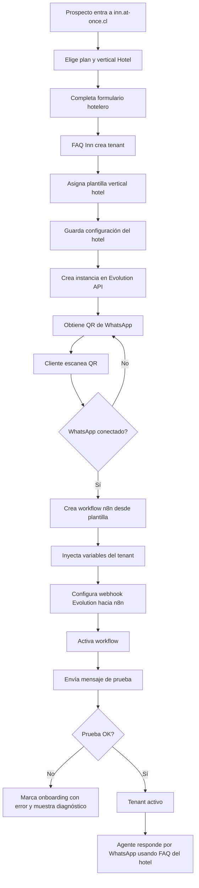

# FAQ Inn

## Bitácora de cambios

| Fecha | Versión | Cambio realizado | Motivo | Impacto | Sección afectada |
|---|---|---|---|---|---|
| 2026-07-02 | V1.1 | Se define `faq-inn` como repositorio GitHub oficial del proyecto. | El proyecto necesitaba una definición documental explícita para evitar ambigüedad entre reutilizar `dfaq`, crear branch/fork o mantener repositorio propio. | El Programador debe usar `faq-inn` como repositorio independiente de FAQ Inn; DFAQ/MorroReservas queda sin cambios operativos. | Repositorio GitHub oficial, Etapa técnica inicial, Estado actual |
| 2026-07-02 | V1.0 | Creación del proyecto FAQ Inn como evolución separada de DFAQ para vertical Hoteles y futura arquitectura multivertical. | MorroReservas está en producción y debe quedar congelado; el nuevo producto requiere onboarding, Evolution API, QR WhatsApp y generación automática de workflows n8n sin afectar `dfaq.at-once.cl`. | Se crea proyecto documental separado bajo `FAQ Inn`; `dfaq.at-once.cl` queda como producción/legacy de MorroReservas y `inn.at-once.cl` queda como dominio objetivo del nuevo producto. | Todo el documento |

---

## 1. Objetivo del proyecto

Construir **FAQ Inn**, una plataforma SaaS inicialmente orientada a hoteles, hospedajes y alojamientos, basada en el aprendizaje técnico de DFAQ/MorroReservas pero separada de la producción existente.

El objetivo es que un nuevo cliente hotelero pueda registrarse, cargar datos de su negocio, vincular su WhatsApp mediante QR, cargar sus preguntas y respuestas, y quedar con un agente operativo sin que Miguel tenga que editar manualmente n8n, Qdrant, Evolution API o archivos técnicos.

El producto debe nacer como **Hotel v1**, pero con diseño **multivertical** para permitir futuras verticales como ferretería, clínica, comercio, servicios profesionales u otras.

---

## 2. Decisión de separación respecto de DFAQ

### 2.1 MorroReservas queda congelado

MorroReservas ya está operativo en producción y no debe usarse como laboratorio.

Regla vigente:

```text
MorroReservas / dfaq.at-once.cl = producción estable
FAQ Inn / inn.at-once.cl = nuevo producto SaaS hotelero/multivertical
```

### 2.2 DFAQ queda como base técnica e histórica

El proyecto `FAQ multiusuario` conserva la documentación y base técnica de DFAQ:

- Administración de FAQ.
- MariaDB como fuente maestra.
- Qdrant como índice vectorial derivado.
- Embeddings NVIDIA/OpenAI.
- API de búsqueda.
- Preguntas sin respuesta.
- Integración actual con MorroReservas.

FAQ Inn hereda aprendizajes de DFAQ, pero no modifica producción.

---

## 3. Alcance inicial

### 3.1 Vertical inicial: Hotel v1

El primer vertical será `hotel`.

El onboarding hotelero debe pedir como mínimo:

| Dato | Uso |
|---|---|
| Nombre comercial | Nombre visible del hotel/alojamiento. |
| `tenant_slug` | Identificador técnico seguro del cliente. |
| Idioma principal | Idioma por defecto del agente. |
| URL de reservas | Link base o plantilla de reservas del hotel. |
| Plantilla de URL de reservas | Permite insertar `checkin`, `checkout` y `guests` si el motor lo soporta. |
| Tipo de alojamiento | Hotel, hostel, posada, apartamento, cabaña, etc. |
| Horario de atención | Contexto para derivación humana. |
| Políticas principales | Check-in, check-out, cancelación, mascotas, niños, desayuno, estacionamiento, etc. |
| Mensaje de bienvenida | Presentación inicial del agente. |
| FAQ iniciales | Preguntas y respuestas aprobadas del cliente. |

### 3.2 Reglas del agente hotelero

El agente Hotel v1 debe:

1. Responder solo con información aprobada por el tenant.
2. No inventar respuestas.
3. Detectar intención de reserva.
4. Recolectar `checkin`, `checkout` y `guests`.
5. Confirmar los datos antes de enviar link de reserva.
6. Construir el link con la URL o plantilla de URL del hotel.
7. Registrar preguntas sin respuesta.
8. Permitir pausa humana mediante prefijo `**`.

---

## 4. Arquitectura objetivo

```text
Cliente hotelero
      ↓
Sitio FAQ Inn — inn.at-once.cl
      ↓
Formulario de onboarding
      ↓
Provisioner interno de FAQ Inn
      ├── crea tenant y configuración
      ├── crea instancia Evolution API
      ├── obtiene QR WhatsApp
      ├── espera conexión
      ├── genera workflow n8n desde plantilla
      ├── configura webhook Evolution → n8n
      ├── activa agente
      └── guarda trazabilidad
      ↓
Agente WhatsApp operativo
```

Principio arquitectónico:

```text
La app FAQ Inn controla el onboarding y el estado del cliente.
n8n ejecuta conversaciones.
Evolution API conecta WhatsApp.
DFAQ/API FAQ administra conocimiento.
Qdrant busca semánticamente.
```

---

## 5. Diagrama funcional del onboarding Hotel v1



---

## 12. Repositorio GitHub oficial

El repositorio GitHub oficial del proyecto FAQ Inn es:

```text
faq-inn
```

Regla vigente:

```text
FAQ Inn mantiene repositorio propio e independiente.
No debe reutilizar el repositorio dfq/dfaq/MorroReservas para desarrollo activo de FAQ Inn.
DFAQ/MorroReservas queda como base técnica heredada y producción/legacy congelada.
```

El Programador debe trabajar sobre `faq-inn` como repositorio oficial del producto nuevo, salvo decisión arquitectónica posterior documentada en este README.
