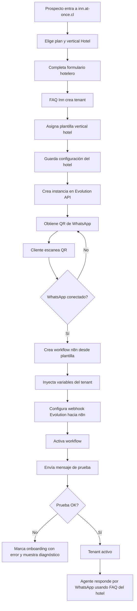

# FAQ Inn

## Bitácora de cambios

| Fecha | Versión | Cambio realizado | Motivo | Impacto | Sección afectada |
|---|---|---|---|---|---|
| 2026-07-02 | V1.6 | Se valida operativamente el PostgreSQL de FAQ Inn. | Miguel ejecuta consulta interna desde el contenedor y confirma respuesta correcta de PostgreSQL. | Queda confirmado PostgreSQL 17.10, base `faq-inn`, usuario `postgres`, puerto interno 5432 y sin puerto público externo. | Configuración EasyPanel PostgreSQL, Estado actual |
| 2026-07-02 | V1.5 | Se confirma creación real del PostgreSQL de FAQ Inn en EasyPanel. | Miguel crea el servicio y aporta captura con credenciales visibles del servicio. | Host interno real confirmado: `n8n_faq-inn_postgres`; base `faq-inn`; usuario `postgres`; imagen `postgres:17`; puerto interno 5432; sin puerto público externo. La contraseña no se documenta. | Configuración EasyPanel PostgreSQL, Estado actual |
| 2026-07-02 | V1.4 | Se define la configuración base para crear PostgreSQL en EasyPanel. | Miguel inicia la creación del servicio Postgres propio de FAQ Inn en EasyPanel. | El servicio debe llamarse `faq-inn_postgres`, usar base `faq-inn`, usuario `postgres`, imagen `postgres:17`, contraseña autogenerada por EasyPanel y sin puerto público externo. | Base de datos, Configuración EasyPanel PostgreSQL |
| 2026-07-02 | V1.3 | Se define PostgreSQL propio e interno para FAQ Inn. | FAQ Inn requiere aislamiento de datos y no debe usar la base compartida existente del ecosistema n8n. | El servicio `faq-inn_postgres` debe operar solo por red interna, en puerto 5432, sin puerto público externo. | Base de datos, Variables por tenant, Próxima etapa técnica, Estado actual |
| 2026-07-02 | V1.2 | Se definen las variables iniciales por tenant y el primer cambio obligatorio para el Programador. | La base heredada desde DFAQ debe reconstruirse como producto multitenant de FAQ Inn, evitando valores fijos del sistema anterior. | El desarrollo debe iniciar en versión de código 1.0 usando tenant de desarrollo `FAQ-INN`, título HTTP `FAQ Inn $Tenant` y base PostgreSQL derivada de `$tenant`. | Variables por tenant, Próxima etapa técnica, Estado actual |
| 2026-07-02 | V1.1 | Se define `faq-inn` como repositorio GitHub oficial del proyecto. | El proyecto necesitaba una definición documental explícita para evitar ambigüedad entre reutilizar `dfaq`, crear branch/fork o mantener repositorio propio. | El Programador debe usar `faq-inn` como repositorio independiente de FAQ Inn; DFAQ/MorroReservas queda sin cambios operativos. | Repositorio GitHub oficial, Etapa técnica inicial, Estado actual |
| 2026-07-02 | V1.0 | Creación del proyecto FAQ Inn como evolución separada de DFAQ para vertical Hoteles y futura arquitectura multivertical. | MorroReservas está en producción y debe quedar congelado; el nuevo producto requiere onboarding, Evolution API, QR WhatsApp y generación automática de workflows n8n sin afectar `dfaq.at-once.cl`. | Se crea proyecto documental separado bajo `FAQ Inn`; `dfaq.at-once.cl` queda como producción/legacy de MorroReservas y `inn.at-once.cl` queda como dominio objetivo del nuevo producto. | Todo el documento |

---

## 1. Objetivo del proyecto

Construir **FAQ Inn**, una plataforma SaaS inicialmente orientada a hoteles, hospedajes y alojamientos, basada en el aprendizaje técnico de DFAQ/MorroReservas pero separada de la producción existente.

El objetivo es que un nuevo cliente hotelero pueda registrarse, cargar datos de su negocio, vincular su WhatsApp mediante QR, cargar sus preguntas y respuestas, y quedar con un agente operativo sin que Miguel tenga que editar manualmente n8n, Qdrant, Evolution API o archivos técnicos.

El producto debe nacer como **Hotel v1**, pero con diseño **multivertical** para permitir futuras verticales como ferretería, clínica, comercio, servicios profesionales u otras.

---

## 2. Decisión de separación respecto de DFAQ

### 2.1 MorroReservas queda congelado

MorroReservas ya está operativo en producción y no debe usarse como laboratorio.

Regla vigente:

```text
MorroReservas / dfaq.at-once.cl = producción estable
FAQ Inn / inn.at-once.cl = nuevo producto SaaS hotelero/multivertical
```

### 2.2 DFAQ queda como base técnica e histórica

El proyecto `FAQ multiusuario` conserva la documentación y base técnica de DFAQ:

- Administración de FAQ.
- MariaDB como fuente maestra.
- Qdrant como índice vectorial derivado.
- Embeddings NVIDIA/OpenAI.
- API de búsqueda.
- Preguntas sin respuesta.
- Integración actual con MorroReservas.

FAQ Inn hereda aprendizajes de DFAQ, pero no modifica producción.

---

## 3. Alcance inicial

### 3.1 Vertical inicial: Hotel v1

El primer vertical será `hotel`.

El onboarding hotelero debe pedir como mínimo:

| Dato | Uso |
|---|---|
| Nombre comercial | Nombre visible del hotel/alojamiento. |
| `tenant_slug` | Identificador técnico seguro del cliente. |
| Idioma principal | Idioma por defecto del agente. |
| URL de reservas | Link base o plantilla de reservas del hotel. |
| Plantilla de URL de reservas | Permite insertar `checkin`, `checkout` y `guests` si el motor lo soporta. |
| Tipo de alojamiento | Hotel, hostel, posada, apartamento, cabaña, etc. |
| Horario de atención | Contexto para derivación humana. |
| Políticas principales | Check-in, check-out, cancelación, mascotas, niños, desayuno, estacionamiento, etc. |
| Mensaje de bienvenida | Presentación inicial del agente. |
| FAQ iniciales | Preguntas y respuestas aprobadas del cliente. |

### 3.2 Reglas del agente hotelero

El agente Hotel v1 debe:

1. Responder solo con información aprobada por el tenant.
2. No inventar respuestas.
3. Detectar intención de reserva.
4. Recolectar `checkin`, `checkout` y `guests`.
5. Confirmar los datos antes de enviar link de reserva.
6. Construir el link con la URL o plantilla de URL del hotel.
7. Registrar preguntas sin respuesta.
8. Permitir pausa humana mediante prefijo `**`.

---

## 4. Arquitectura objetivo

```text
Cliente hotelero
      ↓
Sitio FAQ Inn — inn.at-once.cl
      ↓
Formulario de onboarding
      ↓
Provisioner interno de FAQ Inn
      ├── crea tenant y configuración
      ├── crea instancia Evolution API
      ├── obtiene QR WhatsApp
      ├── espera conexión
      ├── genera workflow n8n desde plantilla
      ├── configura webhook Evolution → n8n
      ├── activa agente
      └── guarda trazabilidad
      ↓
Agente WhatsApp operativo
```

Principio arquitectónico:

```text
La app FAQ Inn controla el onboarding y el estado del cliente.
n8n ejecuta conversaciones.
Evolution API conecta WhatsApp.
DFAQ/API FAQ administra conocimiento.
Qdrant busca semánticamente.
```

---

## 5. Diagrama funcional del onboarding Hotel v1



---

## 6. Provisioner

El provisioning principal debe vivir en la app FAQ Inn, no en n8n.

Motivo:

- El alta de cliente es parte del dominio de negocio.
- La app debe controlar suscripción, tenant, estado, permisos y trazabilidad.
- n8n no debe ser la fuente de verdad del onboarding.
- La app debe poder recrear, pausar, actualizar o auditar workflows.

Responsabilidades del Provisioner:

1. Crear tenant.
2. Crear configuración de vertical.
3. Crear o registrar instancia Evolution API.
4. Obtener y mostrar QR.
5. Esperar estado `connected`.
6. Crear credencial o configuración segura para n8n.
7. Crear workflow n8n desde plantilla.
8. Configurar webhook en Evolution API.
9. Ejecutar prueba final.
10. Marcar tenant como `active` o `error`.

---

## 7. Evolution API y WhatsApp

### 7.1 Decisión MVP

FAQ Inn usará Evolution API como proveedor inicial para WhatsApp por QR.

Motivo:

- Encaja con el onboarding simple para clientes pequeños.
- Permite vinculación por QR de una cuenta WhatsApp existente.
- Es compatible con un modelo SaaS liviano.
- Ya existe experiencia previa en el ecosistema de Miguel.

### 7.2 Abstracción recomendada

Aunque se use Evolution API, la app debe diseñarse con una capa lógica:

```text
WhatsAppProvider
```

Esto permitirá evaluar o migrar en el futuro hacia:

- WAHA.
- WhatsApp Cloud API oficial.
- Otro proveedor compatible.

### 7.3 Datos esperados por instancia

```text
tenant_id
instance_name
evolution_api_url
credencial_evolution_cifrada
phone_number
connection_status
last_qr
connected_at
webhook_url
created_at
updated_at
```

La credencial de Evolution debe guardarse cifrada y no debe mostrarse al cliente.

---

## 8. n8n como motor de conversaciones

n8n ejecutará la conversación del agente, pero no gobernará el alta del cliente.

### 8.1 Plantilla inicial

Se creó un workflow inicial llamado:

```text
FAQ prototipo
```

Este workflow sirve como referencia técnica para transformar MorroReservas en un flujo parametrizable, pero no debe asumirse como plantilla final productiva.

### 8.2 Workflows por cliente

La app FAQ Inn debe poder crear workflows n8n desde una plantilla versionada.

Variables mínimas a inyectar:

```text
tenant_id
agent_id
tenant_slug
vertical
nombre_comercial
prompt_base
prompt_personalizado
booking_url_base
booking_url_template
evolution_instance_name
evolution_api_url
credential_id
webhook_path
faq_search_endpoint
unanswered_endpoint
pause_rule
```

### 8.3 Regla de pausa humana

MVP:

```text
Si un mensaje entrante comienza con **, el agente se pausa para esa conversación.
```

Comportamiento propuesto:

| Comando | Resultado |
|---|---|
| `**5` | Pausa 5 minutos. |
| `**10` | Pausa 10 minutos. |
| `**15` | Pausa 15 minutos. |
| `**` | Pausa por defecto: 10 minutos. |

Mientras `now < pause_until`, n8n no debe responder al cliente, para permitir intervención humana desde WhatsApp.

---

## 9. Modelo multivertical

FAQ Inn debe evitar hardcodear reglas de hotel dentro del motor.

Se propone una tabla o configuración:

```text
vertical_templates
```

Campos conceptuales:

```text
id
vertical_slug
name
status
required_onboarding_fields
prompt_template
conversation_rules
booking_rules
created_at
updated_at
```

Primer registro:

```text
vertical_slug = hotel
name = Hotel v1
```

Futuras verticales podrán tener:

```text
vertical_slug = ferreteria
vertical_slug = clinica
vertical_slug = comercio
```

Cada tenant apunta a una vertical:

```text
tenants.vertical_slug = hotel
```

---

## 10. Datos mínimos por tenant hotelero

```text
id
name
slug
vertical_slug
status
plan
primary_language
booking_url_base
booking_url_template
welcome_message
timezone
human_handoff_enabled
pause_default_minutes
created_at
updated_at
```

Estados sugeridos:

```text
draft
provisioning
waiting_qr_scan
connected
workflow_created
testing
active
error
suspended
cancelled
```

---

## 11. Relación con dominios

| Dominio | Uso |
|---|---|
| `dfaq.at-once.cl` | Producción actual / MorroReservas / DFAQ legacy. |
| `inn.at-once.cl` | Nuevo producto FAQ Inn para vertical hoteles y evolución SaaS. |

Regla:

```text
No usar dfaq.at-once.cl como laboratorio de FAQ Inn.
```

---

## 12. Repositorio GitHub oficial

El repositorio GitHub oficial del proyecto FAQ Inn es:

```text
faq-inn
```

Regla vigente:

```text
FAQ Inn mantiene repositorio propio e independiente.
No debe reutilizar el repositorio dfq/dfaq/MorroReservas para desarrollo activo de FAQ Inn.
DFAQ/MorroReservas queda como base técnica heredada y producción/legacy congelada.
```

El Programador debe trabajar sobre `faq-inn` como repositorio oficial del producto nuevo, salvo decisión arquitectónica posterior documentada en este README.

---

## 13. Variables obligatorias por tenant

FAQ Inn debe reconstruirse como aplicación parametrizada por tenant desde el inicio del desarrollo.

El primer cambio que debe realizar el Programador es iniciar una nueva versión de código **1.0** para FAQ Inn, reemplazando valores heredados o fijos de DFAQ/MorroReservas por variables de tenant.

### 13.1 Tenant de desarrollo

Para desarrollo, pruebas iniciales y validación local, el tenant oficial será:

```text
FAQ-INN
```

Este valor debe tratarse como variable, no como texto fijo definitivo del producto.

### 13.2 Variables base

| Variable | Valor en desarrollo | Uso obligatorio |
|---|---|---|
| `$tenant` | `FAQ-INN` | Identificador principal del tenant en desarrollo. |
| `$app_title` | `FAQ Inn $Tenant` | Título visible en el HTTP/frontend. |
| `$postgres_database` | `$tenant` | Nombre lógico de la base de datos PostgreSQL asociada al tenant. |
| `$tenant_slug` | Derivado de `$tenant` | Identificador seguro para URLs, rutas, workflows y nombres técnicos cuando el sistema no acepte caracteres especiales. |
| `$tenant_display_name` | `FAQ-INN` en desarrollo | Nombre visible o etiqueta administrativa del tenant. |

Regla arquitectónica:

```text
Ningún valor heredado de DFAQ/MorroReservas debe quedar hardcodeado como identidad del nuevo producto.
FAQ Inn debe tomar nombre visible, título HTTP, base MariaDB, workflows, endpoints y configuración desde variables de tenant.
```

### 13.3 Título HTTP/frontend

El título visible de la aplicación debe construirse con esta plantilla:

```text
FAQ Inn $Tenant
```

Para el tenant de desarrollo, el resultado esperado será:

```text
FAQ Inn FAQ-INN
```

Este título debe aplicarse al HTML/HTTP servido por la app, especialmente en el frontend o página principal que entrega `http/`.

### 13.4 Base de datos PostgreSQL

FAQ Inn usará una instancia PostgreSQL propia, independiente de bases compartidas existentes.

El servicio base esperado será:

```text
faq-inn_postgres
```

La conexión será siempre interna por red de EasyPanel/Docker:

```text
faq-inn_postgres:5432
```

Regla vigente:

```text
No publicar puerto externo para PostgreSQL de FAQ Inn.
La aplicación FAQ Inn debe conectarse por hostname interno.
```

La base de datos PostgreSQL debe estar asociada al tenant mediante la variable:

```text
$postgres_database = $tenant
```

Para desarrollo, la base lógica esperada es:

```text
FAQ-INN
```

Si PostgreSQL, Docker, scripts o librerías no aceptan directamente el carácter `-` sin escape o normalización, el Programador debe implementar una derivación técnica segura desde `$tenant_slug`, pero manteniendo documentado que la fuente funcional es `$tenant`.

### 13.5 Alcance de reconstrucción inicial

El Programador debe revisar y reconstruir con variables de tenant, como mínimo:

1. Nombre visible de la aplicación.
2. Título HTML/HTTP.
3. Nombre lógico de base PostgreSQL.
4. Configuración de conexión interna a PostgreSQL.
5. Prefijos o nombres de workflows n8n.
6. Endpoints internos que identifiquen tenant.
7. Configuración de búsqueda FAQ/Qdrant asociada al tenant.
8. Registro de preguntas sin respuesta asociado al tenant.

---

## 14. Configuración EasyPanel PostgreSQL

Para crear la instancia PostgreSQL propia de FAQ Inn en EasyPanel, usar estos valores base:

| Campo EasyPanel | Valor |
|---|---|
| Nombre del servicio | `faq-inn_postgres` |
| Nombre real en red EasyPanel | `n8n_faq-inn_postgres` |
| Nombre de la base de datos | `faq-inn` |
| Usuario | `postgres` |
| Contraseña | Generada por EasyPanel; no documentar en texto plano |
| Imagen Docker | `postgres:17` |
| Puerto interno | `5432` |
| Puerto público externo | No publicado |
| Conexión esperada | Solo interna por red EasyPanel/Docker |

Reglas:

```text
La contraseña generada por EasyPanel no debe documentarse en texto plano.
No publicar PostgreSQL de FAQ Inn hacia internet ni hacia el host si no es estrictamente necesario.
La app FAQ Inn debe consumir PostgreSQL por nombre interno del servicio.
```

Nota de normalización:

```text
El tenant funcional de desarrollo sigue siendo FAQ-INN.
La base técnica inicial en PostgreSQL se crea como faq-inn para mantener compatibilidad con nombres seguros en PostgreSQL, Docker y herramientas.
```

---

## 15. Próxima etapa recomendada

### 14.1 Etapa documental inmediata

1. Registrar FAQ Inn en el README raíz de @Acer.
2. Mantener DFAQ sin cambios operativos.
3. Usar este README como fuente oficial inicial del nuevo proyecto.
4. Mantener `faq-inn` como repositorio GitHub oficial del proyecto.

### 14.2 Etapa técnica inicial

1. Crear o vincular el repositorio GitHub `faq-inn` como repositorio propio del proyecto.
2. Iniciar versión de código **1.0** de FAQ Inn usando variables de tenant.
3. Definir `$tenant = FAQ-INN` para desarrollo.
4. Cambiar el título HTTP/frontend a `FAQ Inn $Tenant`.
5. Asociar PostgreSQL al tenant mediante la variable de base definida para FAQ Inn y conexión interna del servicio PostgreSQL.
6. Reconstruir configuración heredada de DFAQ para que nombres, endpoints, base de datos, workflows y búsqueda dependan del tenant.
7. Diseñar modelo de datos para `vertical_templates`, `tenant_provisioning`, `whatsapp_instances` y `n8n_workflows`.
8. Definir plantilla final de prompt Hotel v1.
9. Definir contrato con Evolution API.
10. Definir contrato con n8n para creación de workflows.
11. Crear primer tenant demo hotelero sin tocar MorroReservas.

---

## 16. Base técnica heredada desde DFAQ

Para que el Programador pueda partir desde una base ya validada, se copió una base técnica limpia desde `FAQ multiusuario` hacia `FAQ Inn`.

Incluye:

- `api/` — backend Fastify, PostgreSQL, rutas FAQ, búsqueda, Qdrant, embeddings y preguntas sin respuesta.
- `http/` — frontend/nginx y proxy hacia API.
- `.cursor/` — reglas de trabajo para Cursor/Programador.
- `scripts/` — scripts de apoyo heredados.
- `DEPLOY.md`, `Dockerfile`, `Dockerfile.http` — base de despliegue a adaptar.
- `docs/N8N-SEARCH.md` — contrato histórico de búsqueda desde n8n.

No se copió `.env`, datasets operativos, imágenes históricas ni archivos temporales.

Detalle oficial: [docs/base-heredada-dfaq.md](docs/base-heredada-dfaq.md).

---

## 17. Estado actual

```text
Proyecto documental creado.
Repositorio GitHub oficial definido: faq-inn.
Variables iniciales por tenant definidas.
Tenant de desarrollo definido: FAQ-INN.
Título HTTP/frontend objetivo definido: FAQ Inn $Tenant.
Base PostgreSQL lógica definida por tenant mediante variable propia del proyecto.
Base técnica DFAQ copiada como punto de partida.
MorroReservas permanece congelado.
Dominio objetivo definido: inn.at-once.cl.
Vertical inicial definida: Hotel v1.
Arquitectura SaaS/multivertical definida a nivel conceptual.
Pendiente: merge a ramas api/http en EasyPanel, diseño técnico del Provisioner y primer MVP operativo.
```
