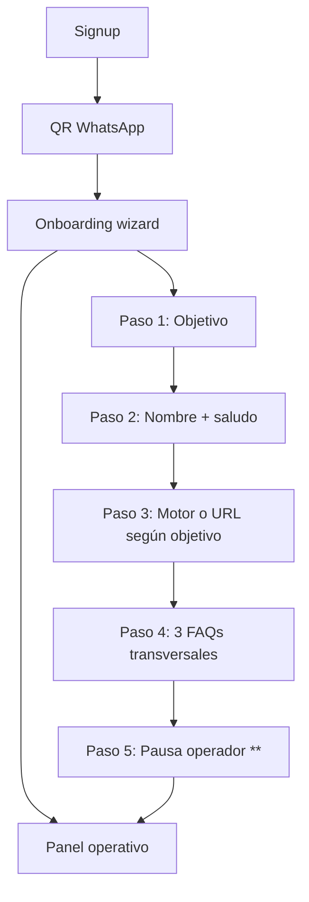

# Onboarding de tenants FAQ Inn

Documento vigente del flujo de alta: cuenta, WhatsApp, onboarding dedicado (distinto de Mi cuenta).

## Principio

```text
Onboarding = wizard único post-WhatsApp (objetivo, negocio, motor/URL, FAQs, pausa operador)
Mi cuenta   = mantenimiento posterior (perfil, cambios, recordatorios)
```

El onboarding **no** es la pantalla Mi cuenta. Es una ruta/vista bloqueante hasta `onboarding_completed = true`.

---

## Flujo completo

```text
1. Crea tu cuenta        → email + contraseña
2. Vincula WhatsApp      → QR Evolution + polling hasta connected
3. Onboarding (wizard)   → ver pasos abajo
4. Panel operativo       → FAQs, sin respuesta, etc.
```



---

## Paso 1 — Elige tu objetivo de negocio

El tenant elige **un** objetivo principal. Solo se habilita la configuración que corresponda.

| Opción visible | `objetivo_slug` | Ejemplos de rubro | Config que sigue |
|---|---|---|---|
| Agendar horarios | `reservar_horarios` | barbería, salón, spa, dentista | Motor de **agenda** |
| Reservar noches | `reservar_noches` | hotel, posada, hostal | Motor de **reservas** |
| Llevar a un sitio web | `enviar_a_sitio_web` | catálogo, landing, tienda | URL destino |
| Solo responder preguntas | `responder_preguntas` | cualquier rubro informativo | Ningún motor ni URL |

Regla: los botones **Configurar motor de reservas** y **Configurar motor de agenda** son distintos; solo se habilita el del objetivo elegido.

Documentos relacionados:

- Motor de reservas (noches): [../motor-reservas/README.md](../motor-reservas/README.md)
- Motor de agenda (horarios): pendiente de módulo hermano

---

## Paso 2 — Datos mínimos del negocio

| Campo | Uso |
|---|---|
| Nombre comercial | Nombre visible del negocio en respuestas del agente |
| Saludo de bienvenida | Presentación única al inicio de cada chat nuevo |
| Idioma principal | Idioma por defecto del agente |

Campos que **ya no** van en onboarding/perfil (pasaron a FAQ):

- Dirección → FAQ transversal «¿Dónde están ubicados?»
- Horario de atención → FAQ transversal «¿Cuál es su horario de atención?»
- Contacto humano → FAQ transversal «¿Puedo hablar con una persona?»

---

## Paso 3 — Configuración según objetivo

| Objetivo | Acción en onboarding |
|---|---|
| `reservar_noches` | Botón **Configurar motor de reservas** (wizard existente en `docs/motor-reservas/`) |
| `reservar_horarios` | Botón **Configurar motor de agenda** (módulo pendiente; misma idea: plantilla aprobada) |
| `enviar_a_sitio_web` | Campo **URL destino** del sitio |
| `responder_preguntas` | Sin paso adicional |

El tenant puede posponer motor/URL y completar después, pero el onboarding debe dejar claro qué falta para operar reservas o derivación web.

---

## Paso 4 — FAQs transversales

Tres FAQs plantilla editables antes de finalizar. Detalle canónico: [faqs-transversales.md](faqs-transversales.md).

```text
1. ¿Dónde están ubicados?
2. ¿Cuál es su horario de atención?
3. ¿Puedo hablar con una persona?
```

---

## Paso 5 — Pausa del operador (obligatorio en onboarding)

Debe quedar **explícito** en el wizard, no solo en Mi cuenta.

Texto canónico:

> Para suspender el agente en una conversación, envíe exactamente **`**`** desde el WhatsApp del negocio.
>
> Para reactivarlo en esa misma conversación, envíe exactamente **`##`**.
>
> La suspensión es persistente: no vence sola y solo afecta ese chat.

Detalle técnico e i18n: [pausa-operador.md](pausa-operador.md).

---

## MVP Evolution (WhatsApp) — ya validado

Etapas 1–2 del flujo (registro + QR) están operativas. Ver [../evolution-api/ESTADO-MODULO.md](../evolution-api/ESTADO-MODULO.md).

### Endpoints provisioner

```text
POST /api/provision/register
POST /api/provision/whatsapp
GET  /api/provision/status/:instance
```

### Reglas de seguridad

```text
El frontend nunca llama directo a Evolution API.
La API key de Evolution vive solo en variables de entorno del backend.
instance_name = faqinn_<tenant_slug>
```

---

## Persistencia esperada

### Flag de onboarding

```text
onboarding_completed  BOOLEAN  DEFAULT false
objetivo_slug         VARCHAR  -- vacío hasta paso 1
destination_url       TEXT     -- para sitio web o agenda simple (fase inicial)
```

### Tablas involucradas

```text
tenants
tenant_settings
tenant_provisioning
evolution_instances
faq_items          -- 3 starter al completar paso 4
agents
```

---

## Onboarding vs Mi cuenta

| | Onboarding | Mi cuenta |
|---|---|---|
| Frecuencia | Una vez (hasta completar) | Siempre disponible |
| Objetivo | Elegir y fijar flujo principal | Ver/editar (si se permite cambio) |
| 3 FAQs plantilla | Edición guiada en wizard | Panel FAQs normal |
| Motor reservas / agenda | Botón según objetivo | Mismo botón, solo el habilitado |
| Pausa `**` | Explicación obligatoria | Recordatorio |
| Contraseña / email | No | Sí |

---

## Criterio de éxito del onboarding completo

```text
Tenant connected en WhatsApp
+ objetivo_slug definido
+ nombre comercial y saludo guardados
+ configuración del objetivo iniciada o pospuesta con aviso claro
+ 3 FAQs transversales confirmadas o editadas
+ operador informado de la pausa con **
→ onboarding_completed = true → acceso al panel
```

---

## Fuera de alcance inmediato

```text
Cambio de objetivo con migración automática de motores
Motor de agenda implementado (solo documentado como hermano del motor de reservas)
Seed retroactivo para tenants legacy (tenants actuales son descartables)
```

## Regla operativa

MorroReservas no debe usarse para pruebas. Todo piloto usa tenants demo nuevos en FAQ Inn.
